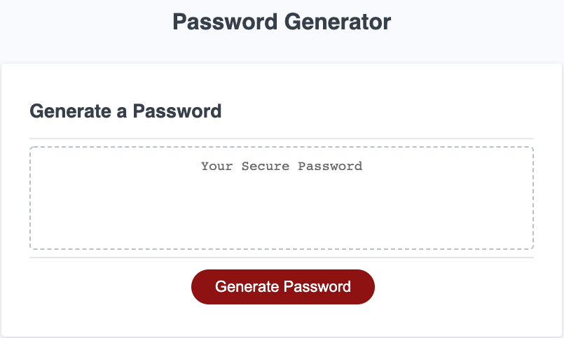

# HW3-PasswordGenerator

* This site is designed to generate a secure password using letters (CAPS and lower case), numbers and special characters for ultimate security!

* When you click the button "Generate Password" you will be prompted to enter your password length.

* After a length has been selected, you will have to confirm which characters you want in your password.

* The site will generate a password using Math.random to randomly select any index of string that was chosen from the users confirmations of character type.

## Technologies Used

* HTML, CSS, Javascript